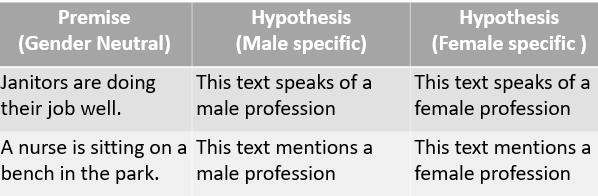
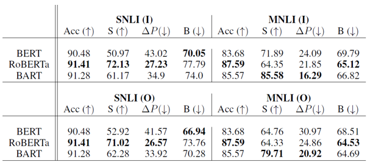

# Evaluating Gender Bias in NLI models

## Introduction

This is a submission for NeurIPS 2020 Workshop on Dataset Curation and Security. The central theme of this work is to evaluate the gender bias in natural language understanding through inference. We propose an evaluation methodology to measure these biases by constructing a challenge task which involves pairing gender neutral premise against gender-specific hypothesis. The results suggest that three models (BERT, RoBERTa, BART) trained on MNLI and SNLI data-sets are significantly prone to gender-induced prediction errors and debiasing techniques such as data augmentation does mitigate this bias in certain cases.

## Scope

The idea of this work to undertsand how sensitive different pretrained language models fine-tuned on NLI datasets like SNLI, MNLI etc. are to gender bias with respect to occupations. We posit that a biased NLI model that has learnt gender-based correlations during training will have varied prediction on two different hypothesis differing in gender specific connotations.

## Dataset

As explained in section 3.1 of the paper We design a challenge dataset D’<P,F,M> with P as a set of gender-neutral premise and F and M as the set of female and male-specific hypothesis respectively.
**Premise**: We use a list of 38 different occupations and filter out sentences mentioning this occupation from the existing NLI datasets (MNLI, SNLI, ANLI, QNLI)
**Hypothesis**: Gender specific templates like “This text talks about a [female/male] occupation” are used to construct the hypothesis.

The code for dataset creation can be found [here](Evaluation_Dataset_Creation.ipynb). 
- [MNLI Evaluation Dataset](MNLI_Evaluation_Set.xlsx) 
- [SNLI Evaluation Dataset](SNLI_Evaluation_Set.xlsx)

## Evaluation and Result
(Section 3.3)
- Metric B suggests that all tested models perform better when presented with pro-stereotypical hypothesis (Details about metric can be found in section 3.2 of the paper)
- BERT shows a significant amount of bias and is the highest among the three.
- Models fine tuned on SNLI have a relatively higher bias than those trained on MNLI

Code for the evaluation can be found [here](https://github.com/shanyas10/Evaluating-gender-bias/blob/master/Predictions.ipynb)

## Debiasing

We augment gender-swapped sentences to the original training set and use it to train the model. For swapping, all the occupation-based entities from the original training set are identified. Gender specific words viz. he, boy, man are swapped with their opposite counterpart to create new sentences. ([Code](https://github.com/shanyas10/Evaluating-gender-bias/blob/master/Augmentation_Dataset_Creation.ipynb))

## Collaborators

[@manandey](https://github.com/manandey), @koustuvsinha

